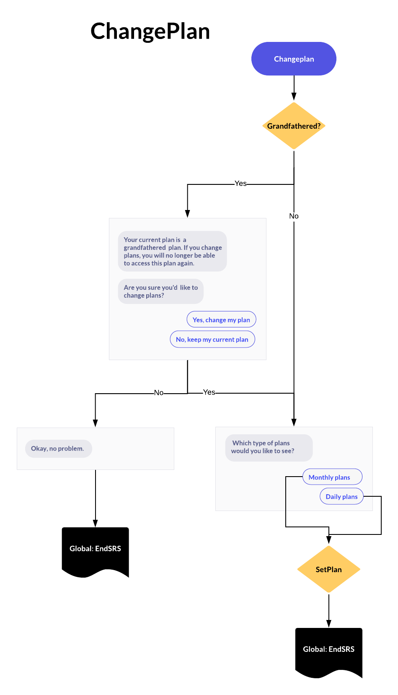

# Building a chatbot for the change plan use case with Rasa

In this repo, I will show how to build a simple chatbot for the change plan use case using Rasa NLU and Rasa Core libraries. In particular, I will show how to build such a system based on a workflow that we designed before. The ChangePlan flow is shown below:



## Walk through the design and annotation

The ontology design and data collection are largely based on the flow.

### Ontology design

The ontology is defined in the [changeplan_domain](changplan_domain.yml) file. There are five user intents and six bot actions. Two slots are involved: planType and isGrandfathered. We also define some prompts.

### Data annotation

The training data for NLU and policy learning are available at [data/nlu/data.json](data/nlu/data.json) and [data/stories.md](data/stories.md) respectively. The NLU annotations are manually generated while the policy annotations are created by rolling out the workflow.

## How to use this repo

You can use the repo to build a chatbot within a few minutes!

### Install Rasa NLU and Rasa Core

Install Rasa libraries with:

```pip install rasa=0.15.0a6```

If this does not work, then:

```pip install rasa-core==0.13.2
pip install rasa-nlu==0.14.6```

### Training the NLU model

To train and test the NLU model run:  

``` python nlu_model.py ```

### Training the Rasa Core model

To run the dialogue manager, we need to start a server that is configured in a 'endpoints.yml' file.  This is how to train and run the dialogue management model:  
1. Start the custom action server by running:  

``` python -m rasa_core_sdk.endpoint --actions actions ```  

2. Open a new terminal and train the Rasa Core model by running:  

``` python dialogue_management_model.py```  
 
3. Talk to the chatbot once it's loaded.  

### Starting the interactive training session:

We can use the Rasa interactive training feature to collect more training data for both NLU and policy learning. The process of running the interactive session is very similar to training the Rasa Core model:
1. Make sure the custom actions server is running:  

``` python -m rasa_core_sdk.endpoint --actions actions ```  

2. Start the interactive training session by running:  

``` python train_interactive.py ```  


